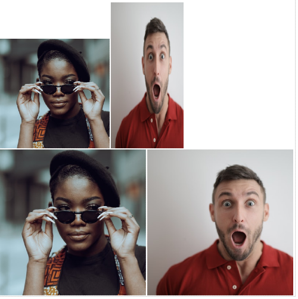

# Сцепление селекторов

Благодарности за изображения в этом упражнении принадлежат [Katho Mutodo](https://linktr.ee/photobykatho_) и [Andrea Piacquadio](https://www.pexels.com/@olly?utm_content=attributionCopyText&utm_medium=referral&utm_source=pexels).

В этом упражнении мы предоставили вам частично завершенный HTML-файл, который вы настроите. Цель этого упражнения - сосредоточиться на понимании того, как сцеплять различные селекторы, а не только добавлять атрибуты. Кроме того, у вас будет возможность просмотреть ваши изображения HTML.

У нас есть два изображения для стилизации, каждое с двумя именами классов, где одно из имен классов общее. Здесь цель - сцепить селекторы для обоих элементов, чтобы каждый из них имел уникальный стиль, несмотря на использование общего селектора класса. Например, вы хотите, чтобы элемент, имеющий как X, так и Y, имел один набор стилей, в то время как элемент с X и Z имел бы совершенно другой набор стилей. Мы также включили оригинальные изображения, чтобы вы могли видеть, как будут выглядеть добавленные вами стили в сравнении, поэтому не добавляйте к ним никаких стилей.

**Примечание:** Загрузите и сгруппируйте изображения в отдельную папку "images". Обеспечьте правильные пути к источникам изображений в вашем HTML, чтобы избежать проблем с загрузкой изображений. Это важно для более чистой структуры проекта.

Свойства, которые вам нужно добавить к каждому элементу:

* Сделайте элемент с классами `avatar` и `proportioned` шириной 300 пикселей, а затем установите высоту так, чтобы он сохранял свои исходные квадратные пропорции (не жестко задавайте значение в пикселях для высоты!).
* Сделайте элемент с классами `avatar` и `distorted` шириной 200 пикселей, а затем установите его высоту в два раза больше его ширины (здесь вы должны жестко задать значение в пикселях).

## Желаемый результат

### Проверка
- Правильно ли вы сцепили селекторы классов для каждого правила?
- Сохраняются ли исходные квадратные пропорции для изображения с классами `avatar` и `proportioned`?
- Получает ли изображение с классами `avatar` и `distorted` вид, будто его раздавило и искривило?
