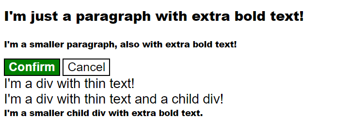

# Методы CSS
Это последнее упражнение по основам CSS позволит вам ближе рассмотреть каскад, в частности, специфичность и порядок правил. Оба файлы, HTML и CSS, заполнены для вас, поэтому вместо того, чтобы добавлять правила самостоятельно, вам просто предстоит редактировать то, что предоставлено.

У нескольких элементов есть проблемы с какой-то специфичностью или порядком правил в предоставленном файле CSS. Вам предстоит выяснить, с какой проблемой сталкивается элемент, и как ее исправить. Вы можете редактировать файл CSS, добавляя, удаляя или редактируя селекторы для блока объявлений или перемещая блоки объявлений. **Не редактируйте файл HTML или фактические стили в CSS**.

Существует несколько способов решить это упражнение, и мы сделали все возможное, чтобы включить все возможные решения для каждого элемента.

Проблемы с каскадом могут быть бичом для многих при работе с CSS. Хотя вы не станете экспертом по каскаду только из этого упражнения, и существуют другие способы решения этих проблем, все равно очень полезно видеть, как эти проблемы влияют на наши окончательные стили и почему важно тщательно упорядочивать правила.

## Желаемый результат

### Проверка
- Вы убедились, что не редактировали файл HTML?
- Если вы добавили селекторы в CSS, они нацелены на допустимый HTML-элемент?

_Примечание: по соображениям доступности стиль в этом упражнении был изменен. Для новых и старых студентов мы предлагаем провести упражнение, обратив внимание на то, насколько важно обращать внимание на доступность веб-сайтов, и мы поддерживаем все больше и больше практик в этом направлении._
