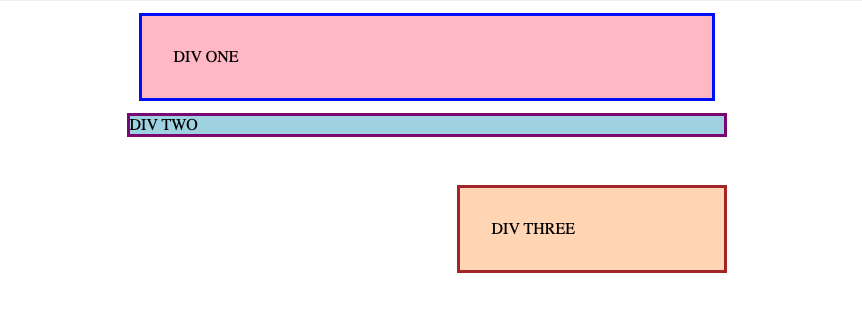

# Практика по margin и padding

Для этого первого упражнения просто отредактируйте файл `style.css` так, чтобы div-элементы выглядели как на изображении ниже. Редактируйте только CSS, указанный в файле. Вам нужно будет изменить только значения margin и padding для этого упражнения. Вам не нужно добавлять или удалять свойства в CSS или изменять HTML.

### Проверка
Используйте этот раздел для проверки своей работы. В этих проектах вашей целью не является достижение 100% пиксельной точности, а использование изученных инструментов для приближения к желаемому результату.

- Div One и Div Three имеют 32px между текстом и границей.
- У Div One есть 12px между ним и любым другим элементом на странице.
- Между Div Two и Div Three есть разрыв в 48px.
- Div Three выровнен по правому краю.
- Выравнивание Div Three достигается с использованием `margin` (не с помощью float, flexbox и т. д.).