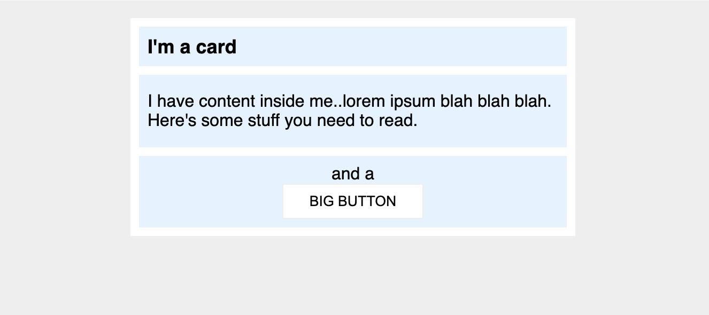

# Практика по margin и padding #2

Этот пример немного красивее и ближе к тому, что вы могли бы увидеть в реальном мире. Вам нужно будет изменить немного больше, чем просто margin и padding, чтобы сделать его точно таким же.

## Желаемый результат

### Проверка
Используйте этот раздел для проверки своей работы. В этих проектах вашей целью не является достижение 100% пиксельной точности, а использование изученных инструментов для приближения к желаемому результату.

- Между краем карты и ее содержимым (синими секциями) есть 8px.
- Между каждой из синих секций внутри карты есть разрыв в 8px.
- Заголовок карты использует шрифт размером 16px.
- Между текстом заголовка и краем секции заголовка есть 8px.
- У секции содержимого есть 16px пространства сверху и снизу, и 8px с каждой стороны.
- Все внутри секции `.button-container` центрировано, и есть отступ в 8px.
- Большая кнопка расположена по центру на своей собственной строке.
- У Большой кнопки есть 24px пространства с боков и 8px сверху и снизу.
